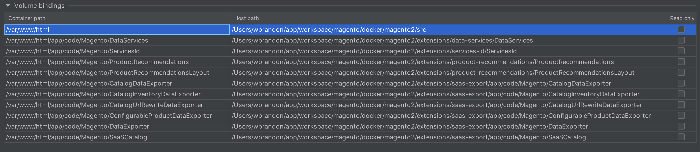
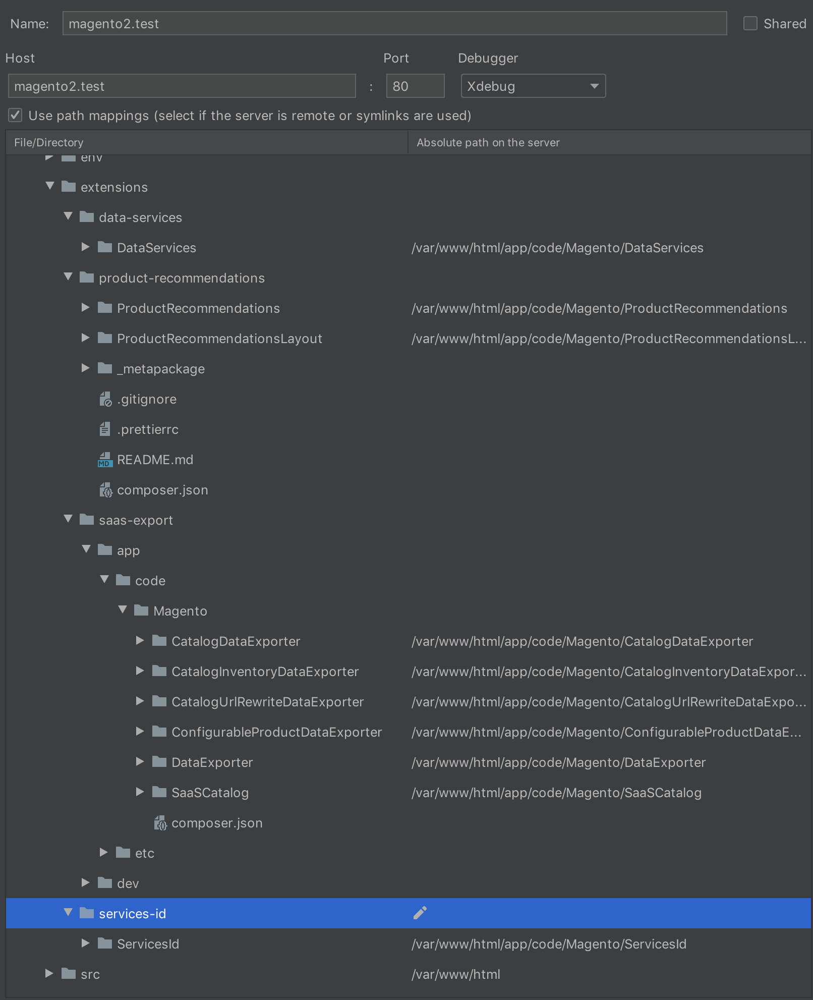

# Data Solutions Docker Magento

This is a customized repository forked from https://github.com/markshust/docker-magento

## Table of Contents

- [Data Solutions Install Instructions](#data-solutions-install-instructions)
- [CLI Commands](#cli-commands)
- [Debug Setup](#debug-setup)

---

### Data Solutions Install Instructions

#### Templated Install

```bash
# Download the Docker Compose template into the specified project directory (Ex. magento2)
curl -s https://raw.githubusercontent.com/rossbrandon/docker-magento/master/lib/template | bash -s -- magento2

# Configure env/install.env file to specify Magento version, edition, Magento install source, and if you need Luma sample data
# Example:
#MAGENTO_VERSION=2.3.4
#MAGENTO_EDITION=open-source
#INSTALL_SOURCE=composer # This is the method used to install Magento only not Data Solutions extensions
#INSTALL_SAMPLE_DATA=true

# Install the Magento source as configured in env/install.env
# Skip this step if you want to use a pre-existing src code directory
bin/install-src

# Create a DNS host entry for the site
# Default site is magento2.test. You may customize this with the MAGENTO_BASE_URL variable in env/install.env
echo "127.0.0.1 ::1 magento2.test" | sudo tee -a /etc/hosts

# Run the setup installer for Magento:
# Then run:
bin/setup

# To install Data Solutions modules (ServicesConnector, ServicesId, DataServices, SaasExport, ProductRecommendations)
bin/install-datasolutions

# Open site
open https://magento2.test
```

#### Automated Setup (New Project)

Run this automated one-liner from the directory you want to install your project to:

```bash
curl -s https://raw.githubusercontent.com/rossbrandon/docker-magento/master/lib/onelinesetup | bash -s -- magento2.test 2.3.3
```

---

### CLI Commands

- `bin/bash`: Drop into the bash prompt of your Docker container. The `phpfpm` container should be mainly used to access the filesystem within Docker.
- `bin/cli`: Run any CLI command without going into the bash prompt. Ex. `bin/cli ls`
- `bin/clinotty`: Run any CLI command with no TTY. Ex. `bin/clinotty chmod u+x bin/magento`
- `bin/composer`: Run the composer binary. Ex. `bin/composer install`
- `bin/copyfromcontainer`: Copy folders or files from container to host. Ex. `bin/copyfromcontainer vendor`
- `bin/copytocontainer`: Copy folders or files from host to container. Ex. `bin/copytocontainer --all`
- `bin/destroy`: Stops docker containers and prunes containers, networks, and volumes - Use when rebuilding entirely
- `bin/dev-urn-catalog-generate`: Generate URN's for PHPStorm and remap paths to local host. Restart PHPStorm after running this command.
- `bin/devconsole`: Alias for `bin/n98-magerun2 dev:console`
- `bin/download`: Download & extract specific Magento version to the `src` directory. Ex. `bin/download 2.3.3`
- `bin/fixowns`: This will fix filesystem ownerships within the container.
- `bin/fixperms`: This will fix filesystem permissions within the container.
- `bin/grunt`: Run the grunt binary. Ex. `bin/grunt exec`
- `bin/install-datasolutions`: Installs Data Solutions extensions to `extensions` directory
- `bin/install-sampledata`: Installs Magento Luma sample data
- `bin/install-src`: Installs Magento code into `src` directory based upon configuration in `.env`
- `bin/magento`: Run the Magento CLI. Ex: `bin/magento cache:flush`
- `bin/mysql`: Run the MySQL CLI with database config from env/db.env. Ex `bin/mysql -e "EXPLAIN core_config_data"`
- `bin/n98-magerun2`: Access the n98 magerun CLI. Ex: `bin/n98-magerun2 dev:console`
- `bin/node`: Run the node binary. Ex. `bin/node --version`
- `bin/npm`: Run the npm binary. Ex. `bin/npm install`
- `bin/pwa-studio`: (BETA) Start the PWA Studio server. Note that Chrome will throw SSL cert errors and not allow you to view the site, but Firefox will.
- `bin/redis`: Run a command from the redis container. Ex. `bin/redis redis-cli monitor`
- `bin/remove`: Remove all containers.
- `bin/removeall`: Remove all containers, networks, volumes, and images.
- `bin/removevolumes`: Remove all volumes.
- `bin/restart`: Stop and then start all containers.
- `bin/root`: Run any CLI command as root without going into the bash prompt. Ex `bin/root apt-get install nano`
- `bin/rootnotty`: Run any CLI command as root with no TTY. Ex `bin/rootnotty chown -R app:app /var/www/html`
- `bin/setup`: Existing script but was customized to fit Data Solutions developer use cases and driven by `env/install.env` configuration
- `bin/setup-grunt`: Install and configure Grunt JavaScript task runner to compile .less files
- `bin/setup-pwa-studio`: (BETA) Install PWA Studio (requires NodeJS and Yarn to be installed on the host machine). Pass in your base site domain, otherwise the default `master-7rqtwti-mfwmkrjfqvbjk.us-4.magentosite.cloud` will be used. Ex: `bin/setup-pwa-studio magento2.test`
- `bin/setup-ssl`: Generate an SSL certificate for one or more domains. Ex. `bin/setup-ssl magento2.test magento3.test`
- `bin/setup-ssl-ca`: Generate a certificate authority and copy it to the host.
- `bin/start`: Start all containers, good practice to use this instead of `docker-compose up -d`, as it may contain additional helpers.
- `bin/status`: Check the container status.
- `bin/stop`: Stop all containers.
- `bin/update`: Update your project to the most recent version of `docker-magento`.
- `bin/xdebug`: Disable or enable Xdebug. Accepts params `disable` (default) or `enable`. Ex. `bin/xdebug enable`

---

### Debug Setup

#### Xdebug & VS Code

Install and enable the PHP Debug extension from the [Visual Studio Marketplace](https://marketplace.visualstudio.com/items?itemName=felixfbecker.php-debug).

Otherwise, this project now automatically sets up Xdebug support with VS Code. If you wish to set this up manually, please see the [`.vscode/launch.json`](https://github.com/markshust/docker-magento/blame/master/compose/.vscode/launch.json) file.

#### Xdebug & PHPStorm

1.  First, install the [Chrome Xdebug helper](https://chrome.google.com/webstore/detail/xdebug-helper/eadndfjplgieldjbigjakmdgkmoaaaoc). After installed, right click on the Chrome icon for it and go to Options. Under IDE Key, select PHPStorm from the list and click Save.

2.  Next, enable Xdebug in the PHP-FPM container by running: `bin/xdebug enable`, the restart the docker containers (CTRL+C then `bin/start`).

3.  Then, open `PHPStorm > Preferences > Languages & Frameworks > PHP` and configure:

    * `CLI Interpreter`
        * Create a new interpreter and specify `From Docker`, and name it `markoshust/magento-php:7-3-fpm`.
        * Choose `Docker`, then select the `markoshust/magento-php:7-3-fpm` image name, and set the `PHP Executable` to `php`.

    * `Path mappings`
        * Don't do anything here as the next `Docker container` step will automatically setup a path mappings.

    * `Docker container`
        * Remove any pre-existing volume bindings.
        * Add the following volume bindings:
            * `/var/www/html` -> `<path_to_project>/src`
            * `/var/www/html/app/code/Magento/DataServices` -> `<path_to_project>/extensions/data-services/DataServices`
            * `/var/www/html/app/code/Magento/ServicesId` -> `<path_to_project>/extensions/services-id/ServicesId`
            * `/var/www/html/app/code/Magento/ProductRecommendations` -> `<path_to_project>/extensions/product-recommendations/ProductRecommendations`
            * `/var/www/html/app/code/Magento/ProductRecommendationsLayout` -> `<path_to_project>/extensions/product-recommendations/ProductRecommendationsLayout`
            * `/var/www/html/app/code/Magento/CatalogDataExporter` -> `<path_to_project>/extensions/saas-export/app/code/Magento/CatalogDataExporter`
            * `/var/www/html/app/code/Magento/CatalogInventoryDataExporter` -> `<path_to_project>/extensions/saas-export/app/code/Magento/CatalogInventoryDataExporter`
            * `/var/www/html/app/code/Magento/CatalogUrlRewriteDataExporter` -> `<path_to_project>/extensions/saas-export/app/code/Magento/CatalogUrlRewriteDataExporter`
            * `/var/www/html/app/code/Magento/ConfigurableProductDataExporter` -> `<path_to_project>/extensions/saas-export/app/code/Magento/ConfigurableProductDataExporter`
            * `/var/www/html/app/code/Magento/DataExporter` -> `<path_to_project>/extensions/saas-export/app/code/Magento/DataExporter`
            * `/var/www/html/app/code/Magento/SaaSCatalog` -> `<path_to_project>/extensions/saas-export/app/code/Magento/SaaSCatalog`



4. Open `PHPStorm > Preferences > Languages & Frameworks > PHP > Debug` and set Debug Port to `9001`.

5. Open `PHPStorm > Preferences > Languages & Frameworks > PHP > DBGp Proxy` and set Port to `9001`.

6. Open `PHPStorm > Preferences > Languages & Frameworks > PHP > Servers` and create a new server:

    * Set Name and Host to your domain name (ex. `magento2.test`)
    * Keep port set to `80`
    * Check the Path Mappings box
    * Add the following path mappings (to match the volume bindings from step 3c above):
        * `./src` -> `/var/www/html`
        * `./extensions/data-services/DataServices` -> `/var/www/html/app/code/Magento/DataServices`
        * `./extensions/services-id/ServicesId` -> `/var/www/html/app/code/Magento/ServicesId` -> `<path_to_project>/extensions/services-id/ServicesId`
        * `./extensions/product-recommendations/ProductRecommendations` -> `/var/www/html/app/code/Magento/ProductRecommendations`
        * `./extensions/product-recommendations/ProductRecommendationsLayout` -> `/var/www/html/app/code/Magento/ProductRecommendationsLayout`
        * `./extensions/saas-export/app/code/Magento/CatalogDataExporter` -> `/var/www/html/app/code/Magento/CatalogDataExporter`
        * `./extensions/saas-export/app/code/Magento/CatalogInventoryDataExporter` -> `/var/www/html/app/code/Magento/CatalogInventoryDataExporter`
        * `./extensions/saas-export/app/code/Magento/CatalogUrlRewriteDataExporter` -> `/var/www/html/app/code/Magento/CatalogUrlRewriteDataExporter`
        * `./extensions/saas-export/app/code/Magento/ConfigurableProductDataExporter` -> `/var/www/html/app/code/Magento/ConfigurableProductDataExporter`
        * `./extensions/saas-export/app/code/Magento/DataExporter` -> `/var/www/html/app/code/Magento/DataExporter`
        * `./extensions/saas-export/app/code/Magento/SaaSCatalog` -> `/var/www/html/app/code/Magento/SaaSCatalog`



7. Go to `Run > Edit Configurations` and create a new `PHP Remote Debug` configuration by clicking the plus sign and selecting it. Set the Name to your domain (ex. `magento2.test`). Check the `Filter debug connection by IDE key` checkbox, select the server you just setup, and under IDE Key enter `PHPSTORM`. This IDE Key should match the IDE Key set by the Chrome Xdebug Helper. Then click OK to finish setting up the remote debugger in PHPStorm.

8. Open up `src/pub/index.php`, and set a breakpoint near the end of the file. Go to `Run > Debug 'magento2.test'`, and open up a web browser. Ensure the Chrome Xdebug helper is enabled by clicking on it > Debug. Navigate to your Magento store URL, and Xdebug within PHPStorm should now trigger the debugger and pause at the toggled breakpoint.


---

[Original Repo Documentation](https://github.com/markshust/docker-magento/blob/master/README.md)
